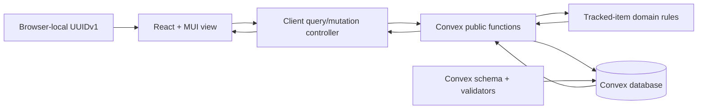
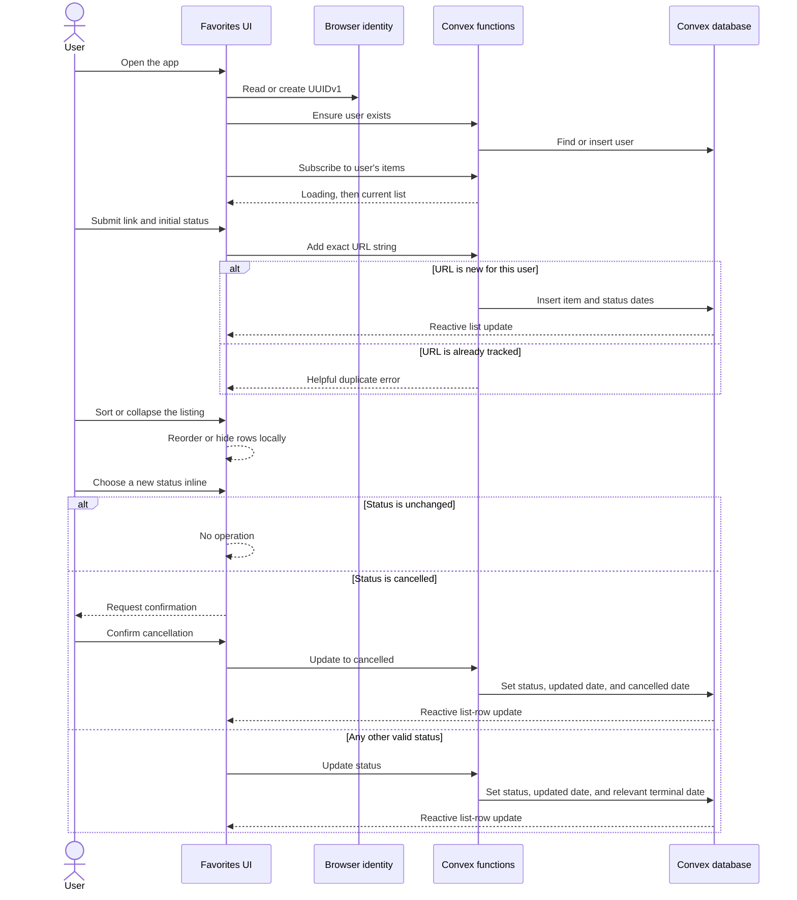

# Favorites Architecture

This document describes the implementation derived from `/KERNEL/`. The kernel remains authoritative.

## System design

The app follows a small domain-driven MVC split. Framework-independent rules live in `models/`; Convex queries and mutations act as controllers around durable storage; React and Material UI provide the presentation.

The presentation is a single, spacious page organized into three levels: a strong page header with the Feneky call-to-action, a compact outlined add form, and a divider-based saved-links section. Link URLs receive the strongest visual emphasis; status controls and locally formatted update dates stay on the quieter second line. Material UI supplies the palette, typography, inputs, dialogs, and responsive behavior, with CSS limited to layout and spacing.

## Data model

`users` stores a unique indexed `userId` UUIDv1 string. `trackedItems` stores `userId`, the immutable exact submitted URL as `uniqueId`, one of the four valid statuses, required started and updated ISO date strings, and optional completed and cancelled ISO date strings.

Convex supplies `_id` and `_creationTime` system fields. They support storage mechanics but do not replace the kernel-required user ID, URL identity, or explicit ISO date fields.

The submitted URL is stored unchanged. The `by_user_and_unique_id` index finds exact duplicates efficiently; a user-scoped transactional comparison also removes one trailing path slash solely for duplicate detection. Duplicate insertion is rejected as an expected application error. The `by_user_id` index scopes reactive list queries to one user. The view orders its reactive result by modified date or URL ID without modifying persisted records.

## User journey

## Validation strategy

- Convex API tests prove UUIDv1 validation, idempotent users, exact and trailing-slash duplicate rejection, selectable initial status, same-status no-ops, ownership-scoped reads, ISO timestamps, and unrestricted status transitions.
- Presentation tests prove the Feneky header link, loading and empty feedback, exact URL and initial-status submission, duplicate feedback, Date/ID sorting, listing collapse, inline status changes, cancellation confirmation, and absence of a detail panel.
- TypeScript production builds verify the generated Convex data model and UI integration.
- ESLint and npm audit cover static quality and known dependency advisories.

## Current boundary

The UUIDv1 is device-local identity, not authentication. Adding sign-in would require a new kernel requirement and an ownership model tied to authenticated principals; it is deliberately not inferred for this MVP.
