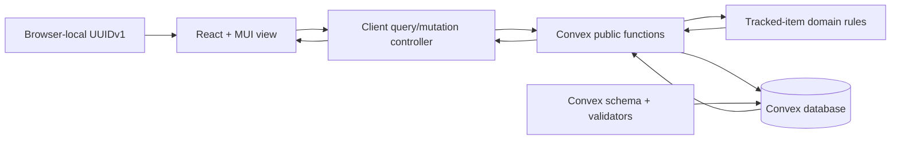
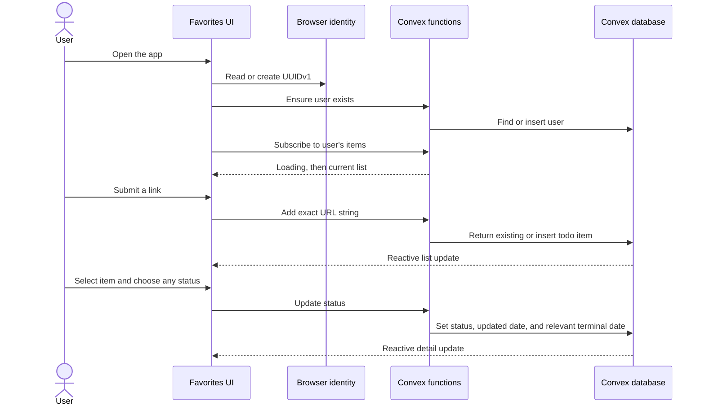

# Favorites Architecture

This document describes the implementation derived from `/KERNEL/`. The kernel remains authoritative.

## System design

The app follows a small domain-driven MVC split. Framework-independent rules live in `models/`; Convex queries and mutations act as controllers around durable storage; React and Material UI provide the presentation.

## Data model

`users` stores a unique indexed `userId` UUIDv1 string. `trackedItems` stores `userId`, the exact submitted URL as `uniqueId`, one of the four valid statuses, required started and updated ISO date strings, and optional completed and cancelled ISO date strings.

Convex supplies `_id` and `_creationTime` system fields. They support storage mechanics but do not replace the kernel-required user ID, URL identity, or explicit ISO date fields.

The `by_user_and_unique_id` index supports idempotent insertion of an exact URL per user. Convex mutations are transactional, so the read-before-insert operation runs atomically. The `by_user_id` index scopes reactive list queries to one user.

## User journey

## Validation strategy

- Convex API tests prove UUIDv1 validation, idempotent users, per-user exact-string uniqueness, ownership-scoped reads, ISO timestamps, and unrestricted status transitions.
- Presentation tests prove loading and empty feedback, exact URL submission, selection, and status interaction.
- TypeScript production builds verify the generated Convex data model and UI integration.
- ESLint and npm audit cover static quality and known dependency advisories.

## Current boundary

The UUIDv1 is device-local identity, not authentication. Adding sign-in would require a new kernel requirement and an ownership model tied to authenticated principals; it is deliberately not inferred for this MVP.

